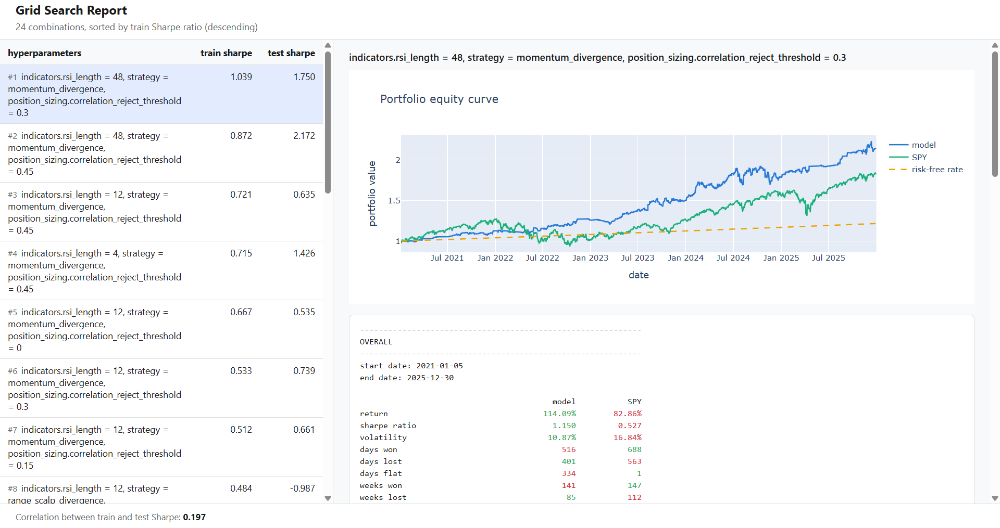

# QuantLoom

**QuantLoom is a comprehensive, end-to-end, technical-analysis-driven quantitative backtesting
engine for swing-trade, mean-reversion equity strategies.** It takes a config file in, and
produces a fully-simulated, statistically-evaluated trading strategy out: it constructs a tradable
equity universe, ingests real historical market data, computes technical indicators and
composable trade signals (RSI divergence, stochastic-momentum confirmation, candlestick reversal
patterns, support/resistance levels), simulates an event-driven multi-asset portfolio against a
configurable nested entry/exit rule engine, and reports professional-grade performance analytics
(Sharpe ratio, block-bootstrap Monte Carlo profit odds, train/test overfitting diagnostics, SPY
benchmarking) — with a multiprocessing-parallelized grid search for hyperparameter optimization
built in from the start.

> **QuantLoom is a research and education tool, not investment advice.** See
> [Disclaimers](#disclaimers) before drawing any conclusion from a backtest it produces.

---

## Table of contents

- [Features](#features)
- [Pipeline](#pipeline)
- [Strategy overview](#strategy-overview)
  - [Buy signals](#buy-signals)
  - [Sell signals](#sell-signals)
- [Default strategies](#default-strategies)
- [How divergences are calculated](#how-divergences-are-calculated)
- [Configuration overview](#configuration-overview)
- [Installation and usage](#installation-and-usage)
- [Data: starter dataset and generating your own](#data-starter-dataset-and-generating-your-own)
- [Libraries used](#libraries-used)
- [Market hours coverage](#market-hours-coverage)
- [The backtest report](#the-backtest-report)
- [Grid search, Sharpe ratio, and overfitting detection](#grid-search-sharpe-ratio-and-overfitting-detection)
- [SPY as a benchmark](#spy-as-a-benchmark)
- [Look-ahead bias](#look-ahead-bias)
- [Transaction costs and slippage](#transaction-costs-and-slippage)
- [Dividend and split adjustments](#dividend-and-split-adjustments)
- [Survivorship bias and overfitting](#survivorship-bias-and-overfitting)
- [File organization](#file-organization)
- [Disclaimers](#disclaimers)

---

## Features

Every feature below is implemented as a discrete, independently-testable pipeline stage (see
[Pipeline](#pipeline)) driven entirely by one validated config object — nothing is hardcoded or
tuned outside of `configs/local.yaml` / `src/quantloom/config/default.yaml`.

- **Ticker universe construction** — resolves the *N* largest US-listed companies by market
  capitalization directly from the SEC's own `company_tickers.json`, with no API key and no HTML
  scraping required.
- **Historical market data ingestion** — pulls real OHLCV bars from Alpaca's Market Data API
  (IEX feed), from 1-minute up to 3-month candles, with chunked, retrying, sequential downloads
  into a per-ticker Parquet store.
- **Technical indicators** — RSI, the Stochastic oscillator (%K/%D, with independent fast/slow
  smoothing windows), rolling realized volatility, and TA-Lib candlestick reversal pattern
  recognition (hammer, engulfing, morning/evening star, three white soldiers/black crows).
- **Swing-point (extrema) detection** — a bar is a confirmed swing high/low only once it is
  strictly more extreme than a configurable number of bars both before *and* after it — the same
  mechanic is applied generically to both price and RSI series.
- **RSI divergence signals** — the core entry edge of every default strategy in this project. A
  *bullish divergence* fires when price makes a lower swing low while RSI simultaneously makes a
  *higher* swing low over the same window: price is still falling, but the momentum behind that
  fall is weakening — a classic precursor to a mean-reversion bounce (bearish divergence is the
  mirror image, for shorting into a resistance high). See
  [How divergences are calculated](#how-divergences-are-calculated) for the exact mechanics.
- **Stochastic crossover confirmation** — a standalone momentum-turn signal: %K entering an
  oversold/overbought extreme, then crossing back over %D, meant to be chained after a divergence
  signal so entries aren't taken until momentum has *already* turned, not just decelerated.
- **Support/resistance level tracking** — a running, always-current "envelope" of confirmed swing
  highs/lows that haven't yet been broken by anything more recent, computed in a single forward
  pass.
- **Composable, chronologically-ordered buy signal chains** — any sequence (and any tie-grouping)
  of the three buy signals above, each stage bounded by its own expiration window, so a strategy
  can require e.g. "divergence, then confirmation, then a reversal candle, all within N bars of
  each other."
- **Nested, multi-condition sell-rule engine** — four independent rule kinds (indicator-level
  threshold, volatility-scaled margin/stop, support/resistance breach, hard time stop), combined
  as OR-across-groups / AND-within-a-group, so an exit can be as simple as "first thing that
  happens" or as strict as "these two conditions, together."
- **Event-driven, multi-asset portfolio simulator** — one merged chronological event stream across
  every ticker in the universe, a hard concurrent-position cap with even-split position sizing,
  and an optional correlation-based entry filter that refuses a new trade outright if it's a
  near-duplicate bet on an already-held position.
- **Long and/or short**, independently toggleable.
- **Professional performance analytics** — annualized return/volatility/Sharpe, day/week/month
  win-loss breakdowns, a block-bootstrap Monte Carlo simulation of forward profit odds, and a
  side-by-side SPY benchmark comparison, computed identically for the overall period and for
  independent train/test sub-periods.
- **Multiprocessing-parallelized grid search** — sweep any config field (or several, as a
  Cartesian product) across worker processes, with an interactive, sortable HTML comparison
  report and a built-in overfitting diagnostic (see
  [Grid search, Sharpe ratio, and overfitting detection](#grid-search-sharpe-ratio-and-overfitting-detection)).
- **Config-first architecture** — every single field is a strictly-validated `pydantic` model with
  its own in-depth description (mechanics, formula, valid range); an unknown or malformed field
  fails immediately at load time, never mid-run. **Every hyperparameter in this project is
  explained in depth in [`docs/CONFIGURATION.md`](docs/CONFIGURATION.md)** — this README covers the
  concepts; that document is the exhaustive reference.

---

## Pipeline

QuantLoom runs as a single linear pipeline, `python -m quantloom.main` (or the `quantloom` console
script) end to end:

1. **Configuration loads.** The packaged defaults
   (`src/quantloom/config/default.yaml`) are deep-merged with an optional local override
   (`configs/local.yaml`, gitignored), then validated into a single strict `Config` object. If a
   top-level `grid:` section is present, it's expanded into the full Cartesian product of every
   swept axis — one fully-validated `Config` per combination — *before* anything else runs.
2. **Universe construction.** The *N* largest US companies by market cap are resolved from the
   SEC's `company_tickers.json` (free, unauthenticated, always resolved fresh regardless of
   whether market data is being refreshed this run).
3. **Data ingestion.** Any universe ticker (plus the SPY benchmark) missing from the on-disk
   Parquet store is downloaded from Alpaca, sequentially and in retrying chunks, and written to
   `{data_dir}/{candle_length}/{ticker}.parquet`. This step is skipped (reusing whatever is
   already on disk) if `refresh_data` is off or `--no-refresh` is passed.
4. **Indicator computation.** RSI, Stochastic %K/%D, rolling volatility, and candlestick pattern
   flags are computed fresh, in memory, for every ticker every run (never written back to disk —
   only raw OHLCV is persisted).
5. **Signal computation.** Swing highs/lows feed both RSI divergence detection and the running
   support/resistance envelope; the stochastic crossover signal is computed independently.
6. **Strategy computation.** The configured buy-signal chain and nested sell-rule groups are
   evaluated bar by bar for every ticker, producing per-ticker `buy_signal_*` / `sell_signal_*` /
   `sell_price_*` columns.
7. **Portfolio simulation.** Every ticker's buy/sell events are merged into one chronological
   stream and simulated by a single shared portfolio: position sizing, the concurrent-position
   cap, and correlation-based entry rejection are all enforced here, at the portfolio level, not
   per-ticker.
8. **Metrics and reporting.** The equity curve is built, a warmup window is trimmed off the front,
   the overall period is (optionally) split into train/test sub-periods, and every metric is
   computed for the model and (if available) for the SPY benchmark, identically, side by side.
9. **Grid search (if configured).** Every combination's steps 4–8 run in its own worker process
   (`ProcessPoolExecutor`); results are collected and ranked.
10. **Reporting.** One interactive HTML report — a single row for a plain run, a sortable
    comparison table for a grid search — opens automatically in your default browser.

---

## Strategy overview

Every default strategy in this project follows the same shape: a **chronologically-ordered chain
of buy signals** decides *when to enter*, and an **independent set of nested sell-rule groups**
decides *when to exit* — the two halves are configured completely separately, and any buy chain
can be paired with any sell-rule configuration.

### Buy signals

A strategy's `buy_signal_order` is a list of *stages* that must all fire, in order (an outer list),
where each stage itself is a list of signal names tied for that position (any order among ties
satisfies that stage). Three signal names are available: `rsi_divergence`, `stochastic_crossover`,
and `candle sticks`. Between every two consecutive signals in the flattened chain,
`buy_signal_expiration_bars` bounds how many bars back the earlier signal is allowed to have fired
relative to the later one, before the chain is considered broken — this is what lets a strategy
express "divergence, then (within 8 bars) a stochastic turn, then (within 10 more bars) a
confirming candle," rather than requiring everything on the same bar. A single-signal chain (the
simplest case — just `rsi_divergence` on its own) needs no expiration window at all.

### Sell signals

`sell_rule_groups` is a list of *groups*; a position closes the moment **all** rules within **any
one** group are simultaneously true (AND within a group, OR across groups) — so a strategy can
give itself several independent, unrelated ways out (e.g. hit a profit target, *or* run out of
time), or require two conditions to agree before it will act (e.g. an RSI exhaustion reading *and*
a support/resistance breach, together). Four rule kinds are available:

| Kind | Day-trading rationale |
|---|---|
| **Indicator** | Exit once RSI, %K, or %D crosses back through a threshold — "the reversion this trade was betting on has now happened, take it off." |
| **Margin** | A take-profit/stop-loss band scaled by the ticker's *own* realized volatility at entry (an "artificial margin," not a fixed percentage) — a 1% band is tight for a volatile name and needlessly loose for a calm one, so the band scales with `price × volatility × multiplier` instead of being a flat constant. |
| **Support/resistance** | Exit when price breaches a known swing level — "buy near support, sell near resistance," the textbook range-trading exit. |
| **Time** | Exit unconditionally after a fixed number of bars — a hard stop against a thesis that just never plays out, dead capital sitting idle. |

When multiple fired groups disagree on the exact exit price (e.g. a margin stop and a
support/resistance breach both fire the same bar), the **most conservative** level wins — the
lowest breached level for a long, the highest for a short — since that's the price a resting order
would have actually been filled at first as price moved through it.

---

## Default strategies

QuantLoom ships six preset strategies (`src/quantloom/config/default.yaml`'s `strategies:`
section), each a deliberately different entry/exit combination built from the same primitives
above. Every preset inherits any field it doesn't explicitly override from a shared
`default_strategy:` block (see [Configuration overview](#configuration-overview)), so the diffs
below are what each preset actually *changes* relative to that shared baseline.

**1. Momentum Divergence** (`momentum_divergence`, the shipped default) — Entry: an RSI
divergence, then (within 8 bars) a stochastic %K/%D crossover out of an oversold/overbought zone.
Exit: an RSI-level cross or a 60-bar time stop only — no margin, no support/resistance. The idea:
don't act on the divergence the moment it's confirmed; wait for stochastic momentum to actually
turn first, trading conviction for a small entry delay, then let the position run until the same
kind of momentum exhaustion (or time) closes it.

**2. Range Scalp Divergence** (`range_scalp_divergence`) — Entry: a raw RSI divergence alone. Exit:
support/resistance or a 60-bar time stop *only* — no volatility margin, no indicator-level exit.
Rationale: a pure chop/range-trading style with no bracket order at all — buy near a known
support level on a divergence, take profit exactly at the next known resistance level (or bail out
on time), nothing else.

**3. Fast RSI Divergence** (`fast_divergence`) — Entry: a raw RSI divergence alone, no
confirmation. Exit: the full four-way stack (indicator level, volatility margin,
support/resistance, or a tight 30-bar time stop) — whichever condition fires first. The
purest, fastest-triggering version of the edge, with the most ways out; a baseline to compare
every other, more selective preset against.

**4. Divergence + Candlestick Confirmation** (`divergence_candlestick_confirmation`) — Entry: an
RSI divergence, then (within 8 bars) a classic reversal candlestick pattern. Exit: margin,
support/resistance, or time. Rationale: a divergence alone is a momentum observation, not price
action — this preset won't act until the market itself prints an actual reversal candle
confirming it, a stricter, later, but more visually-confirmed entry than the fast preset.

**5. Divergence + Candlestick Confluence** (`divergence_candlestick_confluence`) — Entry: an RSI
divergence *and* a reversal candlestick within the same 6-bar window, in **either** order (both
tied in one stage, rather than strictly sequential). Exit: identical to the confirmation preset
above. Rationale: rather than requiring the candle to follow the divergence, this accepts either
ordering as long as both show up close together — a rarer, higher-conviction confluence of two
independent reversal signals rather than one strict causal chain.

**6. Triple Confirmation** (`triple_confirmation`) — Entry: an RSI divergence, then (within 8
bars) a stochastic crossover, then (within 10 more bars) a reversal candlestick — the most
selective, latest-triggering entry of the six. Exit: an RSI-level cross **and** a
support/resistance breach *together* (one AND'd group — both conditions must agree, not either
one alone), or a volatility margin, or a 60-bar time stop. Rationale: since the entry
already demands three independent forms of agreement, the exit mirrors that selectivity by
requiring its own two-condition confirmation before a "normal" exit fires, backed up by a
margin band and a time stop as safety nets.

---

## How divergences are calculated

A divergence pair has two roles. The **anchor** extremum is the older, reference point; the
**trigger** extremum is the newer, actionable one. The anchor is confirmed with a stricter,
slower window (`extrema.divergence_first`, default `before=5, after=5`) — since it's already in
the past by the time the pair matters, the extra confirmation delay costs nothing in real-world
latency. The trigger is confirmed with a faster, looser window
(`extrema.divergence_second`, default `before=5, after=1`), since it dominates how quickly the
overall signal can fire.

A bar only counts as a confirmed swing high/low once it is strictly more extreme than every one
of the `before` bars preceding it *and* every one of the `after` bars following it — meaning it
isn't actually *knowable* until `after` bars later (see [Look-ahead bias](#look-ahead-bias)). The
exact same mechanic is run independently on both the price series and the RSI series; a bar only
qualifies as an anchor/trigger extremum when *both* price and RSI confirm an extremum on that same
underlying bar.

**Pure RSI divergence** (used by every default strategy's entry): walking forward through
confirmed trigger extrema, each consecutive pair is checked as an anchor/trigger candidate. If the
gap between them is under `divergence.expiration_bars` (default 30) and price/RSI moved in
*opposite* directions between the two (price makes a lower low while RSI makes a higher low, for
the bullish/long case — the mirror for bearish/short), it's a divergence, exposed at
`max(anchor confirmation bar, trigger confirmation bar)`.

**Divergence with stochastic-crossover confirmation** (the `momentum_divergence` and
`triple_confirmation` presets): the stochastic crossover is a completely independent, standalone
signal — it does not take a divergence as input at all. It arms a "pending watch" the moment %K
enters an extreme zone (below `extreme_threshold` for long, above `100 − extreme_threshold` for
short), then fires the moment %K crosses back over %D *and* has moved far enough from where it
armed (`cross_level`, either a fixed absolute level or a required move from the armed value),
provided that happens within `expiration_bars` of arming — otherwise the watch expires unfired. A
strategy gets "divergence confirmed by momentum turning" behavior simply by chaining
`rsi_divergence` and `stochastic_crossover` together in `buy_signal_order`; the crossover signal
itself has no idea a divergence exists.

---

## Configuration overview

Every field lives on one strict `pydantic` model (`src/quantloom/config/schema.py`) — an unknown
key or an out-of-range value fails immediately at load time with a clear validation error, never
mid-run. Two YAML files are merged: the packaged defaults
(`src/quantloom/config/default.yaml`) plus an optional, gitignored local override
(`configs/local.yaml` — copy `configs/local.example.yaml` to create it and only list the keys you
want to change).

A few structural features worth knowing up front:

- **Named strategies.** `strategy:` can be an inline block, or a plain string naming a preset
  under a top-level `strategies:` section (see [Default strategies](#default-strategies)) — so
  several reusable strategies can be defined once and swept between by name.
- **`default_strategy:` as a delta base.** If present, every `strategies:` entry is deep-merged
  onto it before validation, field by field and sell-rule by sell-rule *kind* — a preset only
  needs to state what's different, not restate every field.
- **Grid search.** A top-level `grid:` section maps dotted config paths to a list of candidate
  values; QuantLoom runs the full Cartesian product across every listed axis instead of a single
  backtest. A bare field name (e.g. `rsi_length` instead of `indicators.rsi_length`) is
  auto-resolved against the schema as long as it's unambiguous. See
  [Grid search, Sharpe ratio, and overfitting detection](#grid-search-sharpe-ratio-and-overfitting-detection).
- **Train/test split.** `universe.train_test_split_date` breaks every report into an overall
  period plus two sub-periods, read off the *same* continuous equity curve (no re-simulation) —
  see [The backtest report](#the-backtest-report).
- **Position sizing.** `max_positions` is both the hard concurrent-position cap and the basis for
  even-split sizing (`trade_size = cash / (max_positions − currently_open)`), recomputed at every
  entry. `reject_correlated_entries` refuses a new trade outright if its trailing returns are too
  positively correlated with any single currently-held ticker, so a broad-market dip that would
  otherwise trigger a whole cluster of "independent" mean-reversion entries at once doesn't get
  treated as diversification when it isn't.

**Every hyperparameter in this project — mechanics, formula, default, and valid range — is
explained in depth directly on its field in `src/quantloom/config/schema.py`, and worked
numeric examples plus cross-field mechanics live in [`docs/CONFIGURATION.md`](docs/CONFIGURATION.md).**
This README intentionally doesn't restate what's already documented there.

---

## Installation and usage

**Requirements:** Python 3.12+, and the TA-Lib C library installed on your system (the Python
`TA-Lib` wheel wraps it, and won't build without it — see
[ta-lib.org](https://ta-lib.org/install/) for platform-specific install instructions).

```bash
git clone <this-repo-url>
cd QuantLoom
python -m venv .venv
# Windows: .venv\Scripts\activate      macOS/Linux: source .venv/bin/activate
pip install -e ".[dev]"
```

Then run the pipeline directly:

```bash
python -m quantloom.main
# or, equivalently, the installed console script:
quantloom
```

By default this reads `configs/local.yaml` (if present) merged over the packaged defaults, reuses
whatever market data already exists under `data_dir` (`refresh_data: false` by default), and opens
an HTML report in your browser when it finishes. Useful flags:

```bash
python -m quantloom.main --config configs/local.yaml   # explicit config path (this is also the default)
python -m quantloom.main --no-refresh                  # force-skip re-downloading data this run
```

The packaged defaults ship with their own `grid:` section already populated (three RSI lengths ×
two strategy presets × four correlation-rejection thresholds — 24 combinations), so **running the
project with zero configuration changes runs a demo grid search out of the box**, comparing every
combination side by side in the resulting HTML report. Point `configs/local.yaml` at a single
`strategy:`/parameter set (and drop or empty the `grid:` section) to run one plain backtest
instead.

To pull your own market data (a larger or different universe, a different date range, a finer
candle length), set the `ALPACA_API_KEY` / `ALPACA_SECRET_KEY` environment variables (see
[Data](#data-starter-dataset-and-generating-your-own) below) and set `universe.refresh_data: true`
in your local config, or simply omit `--no-refresh`.

---

## Data: starter dataset and generating your own

`sample_data/` ships checked into this repository as a small, ready-to-run starter dataset — 25
large-cap US tickers plus the SPY benchmark, hourly candles, spanning the packaged default date
range (2021–2025). It's the packaged default `data_dir`, so the pipeline runs immediately after
`pip install`, with no API key and no download, against real historical prices.

To generate your **own** data — a bigger universe, a different date range, a different candle
length — QuantLoom ingests from **Alpaca's Market Data API**, which requires a free Alpaca account
(no funding or brokerage subscription needed for historical market data). Set the
`ALPACA_API_KEY` and `ALPACA_SECRET_KEY` environment variables, then run with `refresh_data: true`
(or without `--no-refresh`). Universe *construction* itself (resolving which tickers to trade) is
always free and unauthenticated — it hits the SEC's own ticker list, not Alpaca — only downloading
the actual OHLCV bars requires a key.

A few practical notes carried over from ingestion's own constraints: Alpaca's free-plan historical
bars only go back roughly six years on a rolling basis regardless of requested `start_date` (an
undocumented, empirically-confirmed limit); downloads are strictly sequential (concurrent chunk
downloads reliably trigger rate-limiting); and a large multi-year, thousand-plus-ticker backfill on
a fine candle length is a genuinely slow, one-time cost (see `stock_number`'s field description in
`schema.py` for a concrete time budget). If you point `data_dir` at a much larger dataset, redirect
it off the default `./sample_data` path (e.g. `data_dir: "D:/quant-data/quantloom"`) — the default
`/data/` tree is gitignored precisely so a large personal download never gets committed.

---

## Libraries used

1. **[alpaca-py](https://github.com/alpacahq/alpaca-py)** — the sole source of real historical
   market data; every backtest is only as good as the OHLCV this library pulls in.
2. **[pandas](https://pandas.pydata.org/)** — the backbone data structure for the entire pipeline;
   every indicator, signal, strategy, and metric is a `DataFrame`/`Series` transformation.
3. **[TA-Lib](https://ta-lib.org/)** — RSI, the Stochastic oscillator, and candlestick pattern
   recognition are all computed through TA-Lib's C-optimized, industry-standard implementations
   rather than reimplemented from scratch.
4. **[pydantic](https://docs.pydantic.dev/)** — the entire configuration system's backbone:
   strict, typed, self-documenting validation that turns a typo'd or out-of-range YAML field into
   an immediate, readable error instead of a silent bug.
5. **[NumPy](https://numpy.org/)** — vectorized array operations underlying the custom
   (non-TA-Lib) signal logic: swing-point detection, the Monte Carlo block bootstrap, correlation
   checks.
6. **[PyArrow](https://arrow.apache.org/docs/python/)** — the Parquet read/write layer for the
   on-disk per-ticker market data store.
7. **[Plotly](https://plotly.com/python/)** — renders the equity curve inside the interactive HTML
   report.
8. **[PyYAML](https://pyyaml.org/)** — parses the config YAML files.
9. **[Requests](https://requests.readthedocs.io/)** — the single HTTP call used to resolve the
   ticker universe from the SEC's `company_tickers.json`.
10. **[Matplotlib](https://matplotlib.org/)** — available for ad hoc/dev plotting; not on the
    HTML report's critical path.

---

## Market hours coverage

Ingested bars are **not** limited to the regular 9:30am–4:00pm ET session. IEX (the feed used on
every free Alpaca plan) typically starts a trading day's first bar around **8:00am ET** — a
*partial* premarket window, not the full 4:00am ET premarket session some data vendors offer — but
includes **no after-hours data at all**; the last bar of a session ends exactly at the 4:00pm ET
close. Alpaca's bars request has no extended-hours toggle either way, and nothing downstream —
indicators, signals, or the strategy engine — filters by time of day, so every bar IEX returns is
treated identically regardless of session. There is currently no config option to filter premarket
bars out; if that matters for a particular use case, it's a gap to be aware of rather than a
tunable setting.

---

## The backtest report

Every run opens an HTML report built around three identically-formatted blocks — **OVERALL**,
**TRAIN**, and **TEST** (the latter two only when `train_test_split_date` is set) — each a
side-by-side model-vs-SPY comparison table followed by model-only trade statistics.



Below is a real example (`OVERALL`/`TRAIN`/`TEST` for the same run):

```text
------------------------------------------------------------
OVERALL
------------------------------------------------------------
start date: 2021-01-05
end date: 2025-12-30


                                         model           SPY
return                                114.09%        82.86%
sharpe ratio                            1.150         0.527
volatility                             10.87%        16.84%
days won                                  516           688
days lost                                 401           563
days flat                                 334             1
weeks won                                 141           147
weeks lost                                 85           112
weeks flat                                 34             1
months won                                  39            39
months lost                                 20            20
months flat                                  0             0
chance of profit (2016 bars)           92.99%        77.83%
chance of beating risk-free            85.86%        69.92%
chance of beating SPY: 61.78%
correlation to SPY: 0.341
------------------------------------------------------------
average % of portfolio in the market: 28.63%
volatility / average % of portfolio in the market: 37.98%
trades: 162
trades won: 123
trades lost: 39
average profit per trade (discounting trade size): 1.70%
average profit per trade (accounting trade size): 0.66%
average profit of winning trade: 3.45%
average profit of losing trade: -3.64%
average trade duration (bars): 55.3
most positions at once: 4
------------------------------------------------------------


------------------------------------------------------------
TRAIN
------------------------------------------------------------
start date: 2021-01-05
end date: 2024-12-31


                                         model           SPY
return                                 79.09%        55.99%
sharpe ratio                            1.039         0.475
volatility                             11.30%        16.40%
days won                                  420           544
days lost                                 338           459
days flat                                 245             1
weeks won                                 113           119
weeks lost                                 70            88
weeks flat                                 25             1
months won                                 29            30
months lost                                18            17
months flat                                  0             0
chance of profit (2016 bars)           90.21%        75.91%
chance of beating risk-free            82.62%        67.92%
chance of beating SPY: 61.36%
correlation to SPY: 0.338
------------------------------------------------------------
average % of portfolio in the market: 31.85%
volatility / average % of portfolio in the market: 35.48%
trades: 125
trades won: 90
trades lost: 35
average profit per trade (discounting trade size): 1.67%
average profit per trade (accounting trade size): 0.59%
average profit of winning trade: 3.79%
average profit of losing trade: -3.57%
average trade duration (bars): 64.3
most positions at once: 4
------------------------------------------------------------


------------------------------------------------------------
TEST
------------------------------------------------------------
start date: 2025-01-02
end date: 2025-12-30


                                         model           SPY
return                                 19.55%        16.42%
sharpe ratio                            1.750         0.678
volatility                              9.00%        18.54%
days won                                   96           144
days lost                                  62           103
days flat                                  89             0
weeks won                                  27            28
weeks lost                                 16            24
weeks flat                                  9             0
months won                                  9             8
months lost                                 2             3
months flat                                  0             0
chance of profit (2016 bars)           97.83%        82.16%
chance of beating risk-free            94.06%        75.88%
chance of beating SPY: 61.32%
correlation to SPY: 0.377
------------------------------------------------------------
average % of portfolio in the market: 16.24%
volatility / average % of portfolio in the market: 55.39%
trades: 37
trades won: 33
trades lost: 4
average profit per trade (discounting trade size): 1.77%
average profit per trade (accounting trade size): 0.88%
average profit of winning trade: 2.52%
average profit of losing trade: -4.22%
average trade duration (bars): 25.0
most positions at once: 3
------------------------------------------------------------
```

**Metric-by-metric methodology:**

- **return** — total compounded return over the period: `equity_curve[-1] / equity_curve[0] − 1`.
- **sharpe ratio** — `(annualized_return − risk_free_rate) / annualized_volatility`.
  Annualization uses `sqrt(bars per year)`, where bars-per-year is derived from the data's *own*
  observed bar density rather than a constant tied to one specific candle length, so the same
  formula stays correct if `candle_length` changes.
- **volatility** — the standard deviation of per-bar returns, annualized by the same
  data-derived factor above.
- **days/weeks/months won, lost, flat** — simple period-over-period comparisons of portfolio
  value (resampled to day/week/month-end), counting how often it went up, down, or stayed exactly
  flat.
- **chance of profit (N bars)** — from a block-bootstrap Monte Carlo simulation (see
  [Grid search, Sharpe ratio, and overfitting detection](#grid-search-sharpe-ratio-and-overfitting-detection)'s
  neighboring section below) that resamples the strategy's own realized per-bar returns, in
  contiguous blocks, into thousands of simulated N-bar-long forward paths — the empirical fraction
  of those simulated paths that end above breakeven.
- **chance of beating risk-free** — the same simulated paths' empirical odds of clearing the
  configured annualized risk-free rate, compounded over that same N-bar horizon.
- **chance of beating SPY** — the same simulated paths' empirical odds of clearing SPY's own
  *realized* annualized return over that specific period (overall/train/test each use that
  period's own SPY return as the bar, not the full-history figure), compounded over the same
  horizon. Only reported when the SPY benchmark is available.
- **correlation to SPY** — the Pearson correlation between the model's and SPY's bar-over-bar
  returns, over whatever dates the two share in that period — how much of the strategy's movement
  tracks the broad market versus reflecting its own independent edge.
- **average % of portfolio in the market** — the mean fraction of portfolio value held in open
  positions rather than cash (`1 − cash / equity`, averaged across every reportable bar).
- **volatility / average % of portfolio in the market** — an estimate of what the portfolio's
  volatility would look like if position sizes were scaled up to stay fully invested, instead of
  averaging (in the example above) only ~29% exposure. Dividing realized volatility — already
  diluted by however much of the portfolio sat idle in cash — by average exposure backs out the
  volatility of the capital that's actually deployed, then rescales that to 100% deployment. This
  matters because `average % of portfolio in the market` is itself just a function of tunable
  settings (`max_positions`, `reject_correlated_entries`, how selective the entry chain is) that
  have nothing to do with the underlying edge — two configurations with an identical trade-level
  edge can report very different headline `volatility` purely because one happens to hold more
  cash on average, so this metric isolates risk-per-dollar-deployed from that sizing artifact,
  letting two differently-sized configurations be compared on a like-for-like basis. Treat it as a
  rough, first-order estimate rather than a rigorous forecast, though: it assumes volatility scales
  linearly with position size, which breaks down in practice — sizing up under a fixed
  `max_positions` means fewer, larger, and likely more *correlated* bets (exactly the concentrated
  risk `reject_correlated_entries` exists to catch, which does not scale linearly), and real capital
  deployed at that scale would run into liquidity/market-impact effects this backtest doesn't model
  at all (see [Transaction costs and slippage](#transaction-costs-and-slippage)).
- **trades / trades won / trades lost** — count of closed round-trip trades over the period, and
  how many closed at a profit versus a loss (a loss counts anything ≤ 0, not just strictly
  negative).
- **average profit per trade (discounting trade size)** — the geometric mean return across all
  closed trades, ignoring how large a fraction of the portfolio each trade actually was.
- **average profit per trade (accounting trade size)** — the geometric mean of each trade's return
  weighted by that trade's own size (as a fraction of portfolio capital at entry), so a trade that
  represented a bigger bet contributes proportionally more — a better read on what actually drove
  portfolio-level growth than the size-blind figure above.
- **average profit of winning/losing trade** — the geometric mean return restricted to just the
  winners, or just the losers.
- **average trade duration (bars)** — mean holding period, in bars, across closed trades.
- **most positions at once** — the highest concurrent open-position count reached during the
  period (bounded above by `max_positions`).

---

## Grid search, Sharpe ratio, and overfitting detection

A top-level `grid:` section maps dotted config paths to lists of candidate values; QuantLoom
expands every listed axis into its full Cartesian product and runs **each combination in its own
worker process** (`ProcessPoolExecutor`, sized to the number of combinations or available CPUs,
whichever is smaller) — indicator/signal/strategy computation and the portfolio simulation are all
CPU-bound pandas/TA-Lib work, so separate processes buy real parallelism where threads would just
serialize on the GIL.

Every combination's result is ranked in the resulting HTML report by its **training-period Sharpe
ratio**, descending — the single number used to judge "which combination looked best," precisely
because it's a risk-adjusted, not just raw-return, comparison: a combination that returned more
only by taking on proportionally more volatility doesn't automatically rank above one that
returned less more consistently. The same report shows every combination's **test-period** Sharpe
ratio right alongside it, specifically so it can be compared against the train ranking rather than
trusted blindly.

That comparison is the point of the report's headline diagnostic: **the Pearson correlation
between train Sharpe and test Sharpe, computed across every row in the grid.** A strongly positive
correlation means the parameters that helped in training tended to also help out-of-sample — an
edge that plausibly generalizes. A **flat or negative correlation is a direct overfitting signal**:
it means the sweep is finding parameter values that flatter the training window without a
corresponding (or with an inverse) benefit on the held-out test window — exactly the pattern you'd
expect if a parameter is being tuned to fit training-period noise rather than a real, persistent
edge. When this correlation is weak or negative, prefer whichever combination holds up on the test
period over whichever one simply tops the train-sorted table.

---

## SPY as a benchmark

SPY (the S&P 500 ETF) is used throughout as the buy-and-hold reference point: a broad,
market-cap-weighted large-cap benchmark that's the standard yardstick for "did this strategy
actually add value, or just ride a rising market." Every metric computed for the model — return,
Sharpe, volatility, win/loss breakdowns, Monte Carlo profit odds, and the train/test split — is
computed identically for SPY's own historical price series, so the two are always directly,
apples-to-apples comparable in the same report, period by period.

---

## Look-ahead bias

Look-ahead bias is avoided structurally, at every stage that could otherwise introduce it:

- **Swing points** (the basis for divergences and support/resistance) are only exposed `after`
  bars past the bar they actually occurred on — a swing high/low isn't genuinely knowable until
  enough later bars have failed to exceed it, and the confirmed value is explicitly shifted
  forward before being used anywhere downstream.
- **Divergences** are only exposed at `max(anchor confirmation bar, trigger confirmation bar)` —
  not at the trigger extremum's own raw bar — since neither half of the pair is actually known to
  be a genuine extremum until each has individually survived its own confirmation window.
- **Trade fills execute at the bar's close**, never the same bar's open — filling at the open
  would mean acting on a signal computed from information (that same bar's close) not actually
  available yet at the fill price. An intrabar-level sell trigger (e.g. a margin stop or
  support/resistance breach) fills at the specific level breached, modeling a resting order, not
  at a price that assumes perfect intrabar timing.
- **Correlation-based entry rejection** only ever looks at a trailing window ending at the current
  bar's close — never at future returns.

---

## Transaction costs and slippage

**Transaction costs (commissions, exchange/regulatory fees) and slippage are omitted entirely, for
simplicity.** Every fill in this backtest executes at the exact bar close (or intrabar level) the
signal specifies, with no spread, no market impact, and no per-trade cost deducted. Real-world
execution — especially for a swing strategy with a meaningful trade count and averaging well under
2% profit per trade before sizing (see the example report above) — would be measurably worse than
what's reported here; treat every return/Sharpe figure this project produces as a frictionless
upper bound, not a realistic net-of-costs estimate.

---

## Dividend and split adjustments

Historical bars are requested from Alpaca **without specifying an `adjustment` parameter**, so
QuantLoom trades on Alpaca's raw, unadjusted OHLCV series — the underlying price history is **not**
adjusted for either stock splits or dividends. In practice this means a large stock split will show
up as a sharp, artificial single-bar price discontinuity (which can distort RSI, the Stochastic
oscillator, volatility, and divergence/support-resistance detection around that date), and that
total-return figures throughout this project reflect price return only, with no dividend
reinvestment. This is a known limitation of the current data pipeline, not an intentional
modeling choice — treat any long-running backtest on a dividend-paying or recently-split name with
that in mind.

---

## Survivorship bias and overfitting

Survivorship bias here has nothing to do with which companies are in the ticker universe — it's
about which *strategies* survive the process that produced them. A grid search, by construction,
always produces a "best" row: rank enough parameter combinations by Sharpe ratio and one of them
will look the strongest even if every combination shares the same, non-existent edge and the
differences between them are pure noise. That winning combination "survived" a selection process
that discarded everything else, and it looks good specifically because it was selected using the
same data it's now being judged on — that's the entire mechanism of overfitting. The six strategy
presets shipped with this project are themselves survivors of exactly this kind of iteration: only
the currently-shipped, reasonably-behaved set is visible in this repository, with no record of how
many other variants were tried and quietly discarded along the way. Reading the shipped presets,
or any single grid-search winner, as proof of a real edge — rather than as one surviving candidate
out of a much larger, invisible search — is precisely the mistake this section exists to warn
against.

QuantLoom's own tooling only partially defends against this. The train/test split and the
train/test Sharpe correlation (see
[Grid search, Sharpe ratio, and overfitting detection](#grid-search-sharpe-ratio-and-overfitting-detection))
exist precisely to catch a strategy that only worked on the window it was tuned against — but
nothing stops a user from re-running a sweep with the split date moved until the numbers look
good, or from treating one high-Sharpe row as settled proof rather than a single draw from a
search that discarded many others. Sound backtesting judgment — holding out data the search never
touched, discounting any result in proportion to how many combinations were tried to find it, and
treating every shipped preset and every grid-search winner alike as a survivor rather than a proof
— is squarely the user's responsibility, not something this codebase can enforce for you.

---

## File organization

```
QuantLoom/
├── pyproject.toml                  # Package metadata, dependencies, console entry point
├── configs/
│   └── local.example.yaml          # Template for configs/local.yaml (gitignored machine-specific overrides)
├── docs/
│   └── CONFIGURATION.md            # Exhaustive hyperparameter reference (worked examples, cross-field mechanics)
├── sample_data/                    # Checked-in starter dataset (25 tickers + SPY, hourly, 2021-2025)
├── data/                           # Gitignored: your own larger/refreshed Alpaca download lands here by default
├── tests/                          # pytest suite, one file per module below
└── src/quantloom/
    ├── main.py                     # CLI entry point: config -> pipeline -> HTML report
    ├── config/
    │   ├── schema.py               #   Config, every field's own validated description
    │   ├── loader.py               #   YAML merge, named-strategy resolution
    │   ├── grid.py                 #   Grid expansion (Cartesian product over swept axes)
    │   └── default.yaml            #   Packaged defaults, including the shipped strategy presets
    ├── data/
    │   ├── universe.py             #   SEC-sourced ticker universe resolution
    │   ├── ingest.py               #   Alpaca Market Data API ingestion
    │   └── store.py                #   Per-ticker Parquet storage
    ├── indicators/
    │   └── core.py                 #   RSI, Stochastic, rolling volatility, candlestick patterns
    ├── signals/
    │   ├── extrema.py              #   Swing high/low (look-ahead-safe) detection
    │   ├── divergence.py           #   RSI divergence + stochastic crossover signals
    │   └── levels.py               #   Support/resistance envelope tracking
    ├── strategy/
    │   ├── buy_rules.py            #   Chronological buy-signal chain engine
    │   └── sell_rules.py           #   Nested (AND-within-group / OR-across-group) sell-rule engine
    ├── backtest/
    │   ├── engine.py               #   Event-driven multi-asset portfolio simulator
    │   └── metrics.py              #   Equity curve, Sharpe/volatility, trade stats, Monte Carlo profit odds
    └── reporting/
        ├── report.py               #   Formats one BacktestReport into the console/HTML text block
        ├── grid_report.py          #   Sortable multi-combination HTML comparison report
        └── graphing.py             #   Equity curve plotting (Plotly)
```

---

## Disclaimers

- **QuantLoom is for informational and educational purposes only.** Nothing in this repository —
  its code, its default strategies, its example output, or anything derived from running it —
  should be interpreted as a recommendation to buy, sell, or hold any financial asset.
- **Past performance is not indicative of future results.** A quantitative strategy that backtests
  as extremely profitable can perform very differently across other timeframes, other market
  regimes, and other assets than the ones it was tested on.
- **QuantLoom is a work in progress**, with bugs and oversights that likely exist and have not yet
  been found. It also relies on publicly available financial data (Alpaca, the SEC) that may
  itself contain errors, omissions, or gaps — data accuracy is not guaranteed. Use QuantLoom
  entirely at your own risk.
- Backtested results in this project **omit transaction costs and slippage** (see
  [Transaction costs and slippage](#transaction-costs-and-slippage)) and are **not adjusted for
  dividends or stock splits** (see [Dividend and split adjustments](#dividend-and-split-adjustments)).
  Each of these makes reported performance look better, not worse, than a real, tradable
  implementation of the same strategy would have achieved.
- **Every strategy and every grid-search result in this project is, at best, a survivor of a
  search — not proof of a real edge.** See
  [Survivorship bias and overfitting](#survivorship-bias-and-overfitting).
- This is not an offer, solicitation, or provision of investment advice, and the author accepts
  no liability for any financial decisions made using this software.
